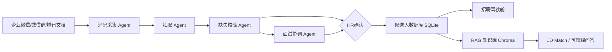

# 基于 AI Agent 的招聘数据自动化落地方案

## 1. 方案定位

本方案将原“AI 表单录入器”升级为轻量级“HR 招聘数据自动录入助手”。重点不是建设复杂决策系统，而是在最小成本下打通企业微信、企业微信群、腾讯在线文档三类日常载体，实现招聘数据自动记录、实时同步更新和可视化。

核心主线：

```text
消息进入 -> AI自动抽取 -> 缺失核验 -> HR确认 -> 自动入库 -> 实时同步看板
```

## 2. 业务目标

- 无需人工复制粘贴：通过 Webhook/文档监听自动采集招聘消息。
- 自动识别招聘事件：候选人信息、面试安排、面试反馈、Offer 结果。
- 自动推进流程状态：统一管理候选人招聘阶段。
- 自动核验缺失字段：缺失超过阈值时生成 AI 回访草稿。
- 自动同步看板：候选人入库后实时更新招聘漏斗、渠道分布、面试进展。
- 保留人在回路：发送通知、回访、批量入库前由 HR 确认。
- 量化业务价值：首页展示人工录入与 AI 录入的效率差异、每日/每周/每月节省时间和预计减少人工录入比例。

## 3. Agent 架构



## 4. Agent 分工

| Agent | 作用 | PoC 实现 | 正式升级 |
|---|---|---|---|
| 消息采集 Agent | 监听企业微信私聊、群聊、腾讯文档变更 | Webhook 模拟按钮和文本模板 | 企业微信回调、会话存档、腾讯文档 API |
| 抽取 Agent | 从自然语言和表格文本中抽取候选人字段 | React 本地规则抽取 | OpenAI 兼容接口 + JSON Schema |
| 缺失核验 Agent | 计算完整度、识别缺失字段、生成回访草稿 | 80% 阈值 + 标签提醒 | 结合岗位必填项、数据字典、审批流 |
| 状态机 Agent | 根据消息和反馈推进阶段 | 本地规则状态机 | ATS 状态同步、消息队列 |
| 面试协调 Agent | 生成沟通话术、邀请、提醒、反馈催收 | 话术草稿 + HITL | 企业微信卡片、日历、邮件 |
| 入库同步 Agent | 批量写入候选人库并更新看板 | localStorage | SQLite / PostgreSQL / ATS |
| RAG 辅助 Agent | 解释推荐、风险、历史案例 | 内置 JD 与案例 mock | Chroma + JD库/题库/录用案例 |

## 5. Bad Case 与置信度机制

真实招聘消息经常不完整，例如：

```text
推荐一个候选人：
李明
本科
浙大
```

该类消息缺少联系方式、应聘岗位、面试安排和反馈，系统不能直接入库。PoC 中采用三档机制：

- 95% 以上：自动入库。
- 80%-95%：待 HR 确认。
- 80% 以下：进入待核验池。

首页同步展示：

- 待核验候选人数。
- 高风险抽取记录。
- 异常字段统计。

## 6. 审计链

每个结构化字段保留审计链：

- 字段名称。
- 字段值。
- 来源渠道。
- 来源位置。
- 原始文本引用。

示例：

```text
字段：学历
值：本科
来源：企业微信群
定位：第4行
原文：“张悦，本科毕业于上海交通大学”
```

这样可以支撑 HR 快速复核，也便于后续审计和问题追踪。

本轮修复进一步收紧了“面试安排”字段识别规则：只有包含真实面试时间、约面动作、面试阶段或面试官信息时，才会被认为是面试安排；类似“维护候选人流程和面试台账”的过往经历不会再被误引用。

## 7. 招聘流程状态机

统一阶段：

```text
简历筛选 -> 待沟通 -> 待面试 -> 一面 -> 复试 -> Offer -> 入职
                                           -> 淘汰
```

自动推进规则：

- 识别到联系方式：简历筛选 -> 待沟通。
- 识别到面试安排、约面、可面：待沟通 -> 待面试。
- 识别到一面、面试反馈、待定：待面试 -> 一面。
- 识别到复试、二面：一面 -> 复试。
- 识别到 Offer、发 Offer：复试 -> Offer。
- 识别到入职：Offer -> 入职。
- 识别到淘汰、不通过、拒绝：任意阶段 -> 淘汰。

## 8. JD Match Skill

输入：

- 岗位 JD。
- 候选人简历/聊天记录/面试反馈。
- 历史录用与淘汰案例。

输出：

- 匹配度评分。
- 优势分析。
- 风险分析。
- 是否建议推进。
- 推荐理由。
- 使用的 JD 规则和历史案例引用。

PoC 中以本地规则模拟，正式版可用 OpenAI 兼容接口：

```text
请根据岗位 JD、候选人 JSON、历史案例检索结果，输出 match_score、strengths、risks、recommendation、reasoning。
要求不要编造缺失字段，所有判断必须引用候选人字段或知识库片段。
```

候选人详情页不再展示代码式 JSON。该区域服务 HR 复核和管理层评审，应展示业务结论、字段审计链和同步状态；标准化 JSON 仍保留在 Agent 工作流页面，用于技术验收和数据结构检查。

Demo 中的知识库中心已支持 JD 点击切换：评审点击不同岗位 JD 后，右侧 Agent 可解释回答会同步更新使用的 JD 规则、风险原因、推荐原因和历史案例引用，避免静态展示造成“不可交互”的观感。

## 9. RAG 知识库

建议建设 5 类知识库：

- 岗位 JD 库。
- 面试题库。
- 历史录用案例库。
- 历史淘汰案例库。
- 招聘标准库。

支持回答：

- 为什么推荐该候选人？
- 为什么淘汰或暂缓？
- 使用了哪条 JD 规则？
- 相似历史候选人的表现如何？
- 当前风险来自字段缺失、稳定性还是面试反馈？

## 10. 数据库设计

PoC 使用 localStorage，正式建议 SQLite 起步：

```sql
CREATE TABLE candidates (
  candidate_id TEXT PRIMARY KEY,
  name TEXT,
  target_role TEXT,
  education TEXT,
  school TEXT,
  major TEXT,
  contact TEXT,
  source TEXT,
  raw_text TEXT,
  extracted_fields TEXT,
  missing_fields TEXT,
  completion_rate INTEGER,
  confidence INTEGER,
  interview_schedule TEXT,
  interviewer TEXT,
  feedback TEXT,
  result TEXT,
  stage TEXT,
  created_at TEXT,
  updated_at TEXT
);
```

向量库建议 Chroma：

```text
collection: job_descriptions
collection: interview_questions
collection: hired_cases
collection: rejected_cases
collection: recruiting_standards
```

## 11. 招聘驾驶舱指标

首页展示：

- 今天新增。
- 待确认。
- 待补充。
- 已入库。
- 今日同步次数。
- 待核验候选人数。
- 面试通过率。
- 录入效率提升。
- 各渠道来源分布。
- 每日新增记录数。
- 招聘漏斗。
- 高风险候选人。
- 预计招聘完成时间。
- 效率提升测算。
- Agent 实时事件流。
- HR 的一天业务演示时间线。

## 12. 低成本落地计划

### 第 1 周：PoC

- 使用 React 页面演示主流程。
- 用 mock Webhook 和 mock JSON 数据验证字段抽取、核验、批量入库、看板同步。
- HR 确认字段和回访草稿。

### 第 2-3 周：试点

- 接入企业微信群机器人或企业微信应用回调。
- 腾讯文档定时拉取或导入。
- SQLite 存储候选人数据。
- OpenAI 兼容接口输出结构化 JSON。

### 第 4-6 周：小规模上线

- 引入 Chroma 知识库。
- 接入面试提醒和反馈催收。
- 记录操作日志、字段来源和人工确认记录。
- 与正式 ATS 做候选人同步。

## 13. 当前 Demo 覆盖

当前 React Demo 已实现：

- 招聘驾驶舱。
- 顶部六步流程导航：消息进入、AI抽取、缺失核验、HR确认、自动入库、看板同步。
- 一键演示模式：自动播放从微信群消息进入到看板刷新的完整链路。
- Agent 工作流。
- 候选人中心。
- 知识库中心。
- 三类输入模板。
- 企业微信消息气泡与腾讯文档导入样式预览。
- 批量候选人抽取。
- 字段来源引用。
- 字段审计链。
- 缺失字段标签与完整度进度条。
- AI 回访草稿。
- 候选人 JSON 预览、复制、下载。
- 批量确认入库。
- 模拟自动同步。
- 搜索、筛选、排序。
- 候选人详情左右布局：基础信息、字段来源、审计链、AI说明、同步状态、原始聊天记录、JSON预览、HR确认记录。
- RAG 知识库 JD 点击切换与解释联动。
- 22 条候选人 mock JSON 数据。
- 单文件预览版 `demo-preview.html`，可直接双击打开，便于非技术评审查看。
- ROI 效率提升测算。
- Bad Case 待核验池。
- 字段审计链。
- Agent 实时事件流。
- “HR 的一天”业务演示流程。
- 多岗位 JD 库示例，覆盖研发、数据、运营、营销、销售、HR 等招聘场景。

## 14. Demo 预览方式

推荐演示方式：

```text
直接双击 demo-preview.html
```

该文件将 React 构建后的 CSS 和 JS 内嵌到一个 HTML 中，不依赖本地服务，适合快速预览和发送给评审。

开发和正式验证方式：

```bash
npm run build
npm run serve
```

然后访问：

```text
http://127.0.0.1:4188/
```

如果源码更新，需要重新生成单文件版：

```bash
npm run build
npm run standalone
```
